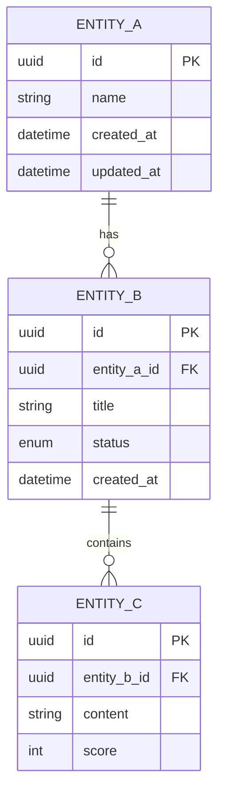

# Database Schema: [Module Name]

**Version:** 1.0
**Last Updated:** YYYY-MM-DD
**Related PRD:** [Link to BA repo]

---

## 1. Entity Relationship Diagram (ERD)



---

## 2. Table Definitions

### 2.1 Table: `entity_a`

| Column | Type | Nullable | Default | Description |
|--------|------|----------|---------|-------------|
| `id` | UUID | NO | gen_random_uuid() | Primary key |
| `name` | VARCHAR(255) | NO | - | Display name |
| `created_at` | TIMESTAMP | NO | NOW() | Creation timestamp |
| `updated_at` | TIMESTAMP | NO | NOW() | Last update timestamp |

**Indexes:**
- PRIMARY KEY on `id`
- INDEX on `name` (for search)

**Constraints:**
- `name` must be unique

---

### 2.2 Table: `entity_b`

| Column | Type | Nullable | Default | Description |
|--------|------|----------|---------|-------------|
| `id` | UUID | NO | gen_random_uuid() | Primary key |
| `entity_a_id` | UUID | NO | - | FK to entity_a.id |
| `title` | VARCHAR(255) | NO | - | Title |
| `status` | ENUM | NO | 'DRAFT' | Status: DRAFT, ACTIVE, COMPLETED |
| `created_at` | TIMESTAMP | NO | NOW() | Creation timestamp |
| `updated_at` | TIMESTAMP | NO | NOW() | Last update timestamp |

**Indexes:**
- PRIMARY KEY on `id`
- INDEX on `entity_a_id` (FK lookup)
- INDEX on `status` (filter)

**Foreign Keys:**
- `entity_a_id` REFERENCES `entity_a(id)` ON DELETE CASCADE

---

## 3. Migration Script

```sql
-- Migration: 001_create_entity_tables
-- Created: YYYY-MM-DD

-- Create enum type
CREATE TYPE entity_b_status AS ENUM ('DRAFT', 'ACTIVE', 'COMPLETED');

-- Create entity_a table
CREATE TABLE entity_a (
    id UUID PRIMARY KEY DEFAULT gen_random_uuid(),
    name VARCHAR(255) NOT NULL UNIQUE,
    created_at TIMESTAMP NOT NULL DEFAULT NOW(),
    updated_at TIMESTAMP NOT NULL DEFAULT NOW()
);

-- Create entity_b table
CREATE TABLE entity_b (
    id UUID PRIMARY KEY DEFAULT gen_random_uuid(),
    entity_a_id UUID NOT NULL REFERENCES entity_a(id) ON DELETE CASCADE,
    title VARCHAR(255) NOT NULL,
    status entity_b_status NOT NULL DEFAULT 'DRAFT',
    created_at TIMESTAMP NOT NULL DEFAULT NOW(),
    updated_at TIMESTAMP NOT NULL DEFAULT NOW()
);

-- Create indexes
CREATE INDEX idx_entity_b_entity_a_id ON entity_b(entity_a_id);
CREATE INDEX idx_entity_b_status ON entity_b(status);

-- Create update trigger for updated_at
CREATE OR REPLACE FUNCTION update_updated_at_column()
RETURNS TRIGGER AS $$
BEGIN
    NEW.updated_at = NOW();
    RETURN NEW;
END;
$$ language 'plpgsql';

CREATE TRIGGER update_entity_a_updated_at BEFORE UPDATE ON entity_a
    FOR EACH ROW EXECUTE FUNCTION update_updated_at_column();

CREATE TRIGGER update_entity_b_updated_at BEFORE UPDATE ON entity_b
    FOR EACH ROW EXECUTE FUNCTION update_updated_at_column();
```

---

## 4. Business Rules Implementation

> These rules come from BA repo: Business_Rules_Log.md

| Rule ID | Database Implementation |
|---------|------------------------|
| BR-XX-01 | UNIQUE constraint on `entity_a.name` |
| BR-XX-02 | CHECK constraint: `status IN ('DRAFT', 'ACTIVE', 'COMPLETED')` |
| BR-XX-03 | Foreign key with ON DELETE CASCADE |

---

## 5. Query Patterns

### 5.1 Common Queries

```sql
-- Get all entity_b for an entity_a with count
SELECT 
    eb.*,
    COUNT(ec.id) as child_count
FROM entity_b eb
LEFT JOIN entity_c ec ON eb.id = ec.entity_b_id
WHERE eb.entity_a_id = $1
GROUP BY eb.id;

-- Search by name (case-insensitive)
SELECT * FROM entity_a
WHERE LOWER(name) LIKE LOWER('%' || $1 || '%')
ORDER BY created_at DESC;
```

---

## 6. Change Log

| Date | Version | Changes | Migration |
|------|---------|---------|-----------|
| YYYY-MM-DD | 1.0 | Initial schema | 001_create_entity_tables |