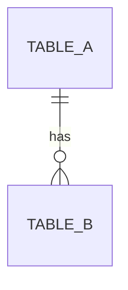
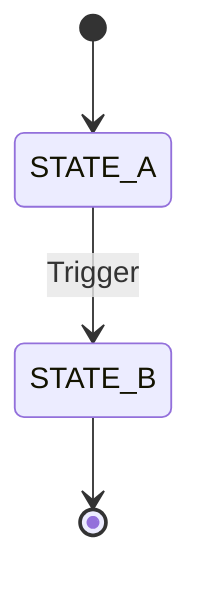

# Implementation Plan: [Feature Name]

**Feature ID:** FR-X-XX
**PRD Reference:** [Link to PRD]
**Author:** [Manager/Senior Name]
**Date:** YYYY-MM-DD

---

## 1. Architecture Overview

### 1.1 Affected Modules
| Module | Impact | Changes |
|--------|--------|---------|
| Backend API | High | New endpoints, business logic |
| Frontend | Medium | New screens, components |
| Database | Low | Add columns |

### 1.2 Tech Stack
- **Backend:** FastAPI / Node.js / ...
- **Frontend:** React / Vue / ...
- **Database:** PostgreSQL
- **External Services:** [LiveKit, Zalo API, etc.]

### 1.3 Dependencies
| Library/Service | Purpose | Status |
|-----------------|---------|--------|
| | | Already installed / Need to add |

---

## 2. Database Changes

### 2.1 New Tables
```sql
CREATE TABLE table_name (
    id UUID PRIMARY KEY DEFAULT gen_random_uuid(),
    field1 VARCHAR(255) NOT NULL,
    field2 INTEGER DEFAULT 0,
    created_at TIMESTAMP DEFAULT NOW(),
    updated_at TIMESTAMP DEFAULT NOW()
);
```

### 2.2 Modified Tables
```sql
ALTER TABLE existing_table 
ADD COLUMN new_column VARCHAR(100);
```

### 2.3 ERD (Mermaid)


---

## 3. API Contracts

### 3.1 Endpoint 1
```yaml
POST /api/v1/resource
Description: [What it does]
Auth: Bearer token (Role required)

Request Body:
  field1: string (required)
  field2: integer (optional)

Responses:
  201:
    description: Created successfully
    body: { id: string, ... }
  400:
    description: Validation error
    body: { error: "CODE", message: "..." }
  401:
    description: Unauthorized
```

### 3.2 Endpoint 2
...

---

## 4. State Machine (if applicable)



---

## 5. Task Breakdown

> [!TIP] Junior devs: Copy each task to prompt AI for code generation.

### Phase 1: Database & Config
- [ ] **Task 1.1:** Create migration file `XXX_create_table_name.sql`
- [ ] **Task 1.2:** Add model in `models/resource.py`
- [ ] **Task 1.3:** Update Alembic and run migration

### Phase 2: Backend Logic
- [ ] **Task 2.1:** Create service `ResourceService` with CRUD methods
- [ ] **Task 2.2:** Implement validation logic per `Validation Rules` in PRD
- [ ] **Task 2.3:** Create controller `ResourceController` with endpoints
- [ ] **Task 2.4:** Add unit tests for service layer

### Phase 3: Frontend
- [ ] **Task 3.1:** Create component `ResourceList.tsx`
- [ ] **Task 3.2:** Create component `ResourceForm.tsx` (modal)
- [ ] **Task 3.3:** Add route in router config
- [ ] **Task 3.4:** Connect to API with TanStack Query

### Phase 4: Integration & Testing
- [ ] **Task 4.1:** Manual testing per Acceptance Criteria
- [ ] **Task 4.2:** Fix bugs from QA
- [ ] **Task 4.3:** Code review & cleanup

---

## 6. Side Effects & Async Jobs

| Trigger | Action | Implementation |
|---------|--------|----------------|
| After create | Send email | Celery task |
| After update | Log activity | Sync to audit log |

---

## 7. Security Checklist

- [ ] Authentication required?
- [ ] Authorization (role-based)?
- [ ] Input validation on all endpoints?
- [ ] SQL injection prevention?
- [ ] XSS prevention (if user-generated content)?

---

## 8. Rollout Plan

| Step | Action | Owner |
|------|--------|-------|
| 1 | Deploy to staging | Dev |
| 2 | QA testing | QA |
| 3 | Stakeholder approval | PM |
| 4 | Deploy to production | Dev |
| 5 | Monitor for 24h | Dev |