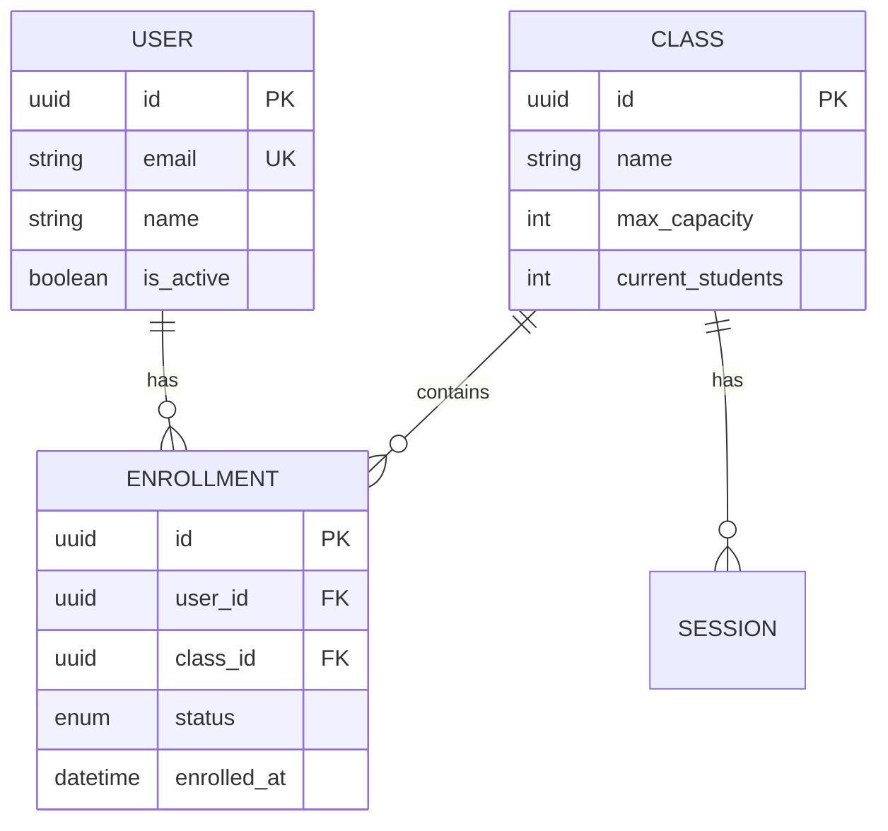
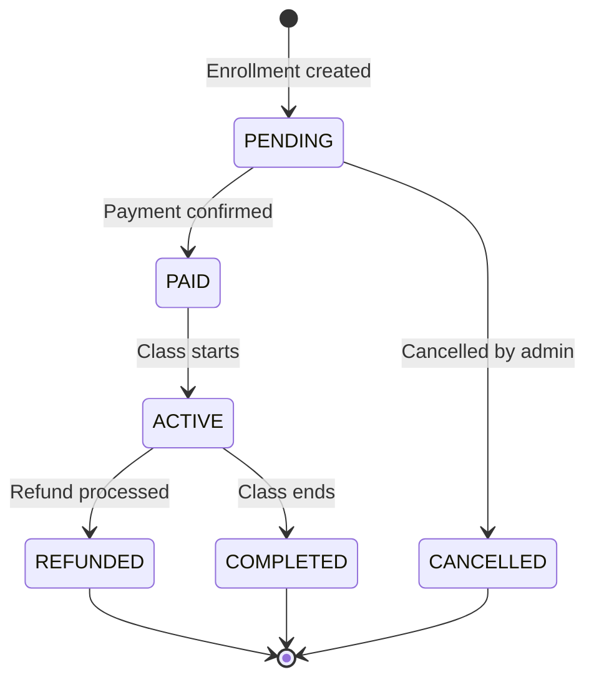

# Dev Documentation Guide

This document defines the standards and templates for Developers (Dev Repo) based on the [AI-Friendly Documentation Standard](../README.md).

## 📁 Standard Folder Structure (Dev Repo)

```text
/docs/
│
├── api/                            # API Design
│   ├── openapi.yaml                # ⭐ OpenAPI spec (auto-generate docs)
│   └── endpoints/                  # Per-module API docs
│       └── enrollment.md
│
├── database/                       # Database Design
│   ├── schema.md                   # ⭐ ERD + Tables
│   └── migrations/                 # Migration files
│
├── architecture/                   # System Architecture
│   ├── state-machines/             # ⭐ State transitions
│   │   └── enrollment_states.md
│   └── decisions/                  # ADR (Architecture Decision Records)
│
├── implementation/                 # Implementation Plans
│   └── plans/
│       └── IP_Feature_X.md         # Task breakdown per feature
│
└── nfrs/                           # Non-functional requirements
    └── performance.md
```

## 📋 Required Documents (Technical Implementation)

| Document | Purpose | AI Input |
|----------|---------|----------|
| **API Contracts (OpenAPI)** | Endpoints definition | Generate controllers, services |
| **Database Schema (ERD)** | Data structure | Generate migrations, models |
| **State Machines** | Entity with multiple states | Transition logic |
| **Implementation Plans** | Task breakdown for devs | Generate code per task |
| **NFRs** | Non-functional requirements | Performance, security guidelines |

## 🔧 Formatting Rules

### Rule 1: API Contracts Must Be in OpenAPI Format

```yaml
POST /api/v1/admin/enrollments
Description: Enroll a student into a class manually
Auth: Bearer token (Admin role)

Request Body:
  user_id: string (uuid, required)
  class_id: string (uuid, required)
  payment_status: enum [PENDING, PAID] (default: PAID)

Responses:
  201:
    body: { id: string, status: string, enrolled_at: datetime }
  400:
    body: { error: "CLASS_FULL", message: "Maximum capacity reached" }
  409:
    body: { error: "ALREADY_ENROLLED", message: "User already enrolled" }
```

### Rule 2: Database Schema Must Have a Mermaid ERD



### Rule 3: State Machine Must Have a Diagram



## 📝 Templates

- [API Contracts Template](./API_Contracts_Template.md) - OpenAPI format
- [Database Schema Template](./Database_Schema_Template.md) - ERD + migrations
- [State Machine Template](./State_Machine_Template.md) - State transitions
- [Implementation Plan Template](./Implementation_Plan_Template.md) - Task breakdown
