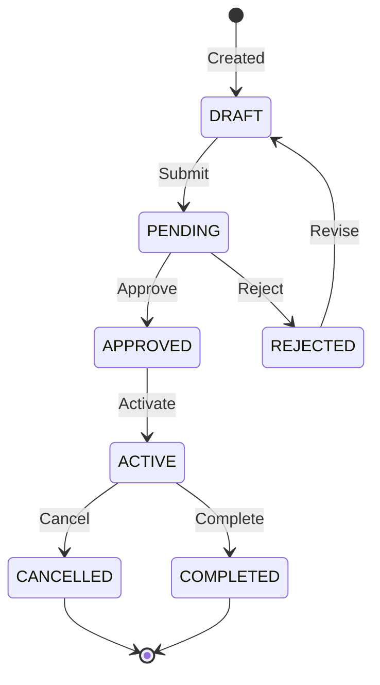

# State Machine: [Entity Name]

**Entity:** [e.g., Enrollment, Payment, Order]
**Related PRD:** [Link to BA repo]
**Related Business Rules:** [Link to Business_Rules_Log.md]

---

## 1. State Diagram



---

## 2. State Definitions

| State | Description | Entry Actions | Exit Actions |
|-------|-------------|---------------|--------------|
| DRAFT | Initial state, editable | - | - |
| PENDING | Submitted, awaiting approval | Notify approvers | - |
| APPROVED | Approved, ready to activate | - | - |
| ACTIVE | Currently active | Start services | - |
| COMPLETED | Successfully finished | Archive records | - |
| REJECTED | Rejected by approver | Notify submitter | - |
| CANCELLED | Cancelled | Refund if needed | - |

---

## 3. Transition Rules

| From State | To State | Trigger | Condition | Side Effects |
|------------|----------|---------|-----------|--------------|
| DRAFT | PENDING | submit() | Required fields filled | Send notification |
| PENDING | APPROVED | approve() | Approver has permission | - |
| PENDING | REJECTED | reject() | Approver has permission | Send notification |
| APPROVED | ACTIVE | activate() | Start date reached | Start services |
| ACTIVE | COMPLETED | complete() | End condition met | Archive |
| ACTIVE | CANCELLED | cancel() | User/Admin request | Refund if applicable |
| REJECTED | DRAFT | revise() | - | - |

---

## 4. Business Rules Mapping

| Rule ID | From Business Rules Log | Implementation |
|---------|------------------------|----------------|
| BR-XX-01 | Max 2 reschedules per course | Counter in entity, checked before transition |
| BR-XX-02 | Refund within 24h only | Check timestamp before CANCELLED transition |
| BR-XX-03 | Admin can force transition | Bypass condition check if admin role |

---

## 5. Code Implementation (TypeScript Example)

```typescript
enum EntityState {
  DRAFT = 'DRAFT',
  PENDING = 'PENDING',
  APPROVED = 'APPROVED',
  ACTIVE = 'ACTIVE',
  COMPLETED = 'COMPLETED',
  REJECTED = 'REJECTED',
  CANCELLED = 'CANCELLED'
}

const VALID_TRANSITIONS: Record<EntityState, EntityState[]> = {
  [EntityState.DRAFT]: [EntityState.PENDING],
  [EntityState.PENDING]: [EntityState.APPROVED, EntityState.REJECTED],
  [EntityState.APPROVED]: [EntityState.ACTIVE],
  [EntityState.ACTIVE]: [EntityState.COMPLETED, EntityState.CANCELLED],
  [EntityState.COMPLETED]: [],
  [EntityState.REJECTED]: [EntityState.DRAFT],
  [EntityState.CANCELLED]: []
};

function canTransition(current: EntityState, target: EntityState): boolean {
  return VALID_TRANSITIONS[current]?.includes(target) ?? false;
}

function transition(entity: Entity, targetState: EntityState, user: User): Result<Entity> {
  // Check valid transition
  if (!canTransition(entity.state, targetState)) {
    return Err(`Invalid transition: ${entity.state} -> ${targetState}`);
  }
  
  // Check business rules
  const ruleCheck = checkBusinessRules(entity, targetState, user);
  if (ruleCheck.isErr()) {
    return ruleCheck;
  }
  
  // Execute transition
  const oldState = entity.state;
  entity.state = targetState;
  entity.updatedAt = new Date();
  
  // Execute side effects
  executeSideEffects(entity, oldState, targetState);
  
  return Ok(entity);
}
```

---

## 6. Database Schema

```sql
-- Enum type
CREATE TYPE entity_state AS ENUM (
  'DRAFT', 'PENDING', 'APPROVED', 'ACTIVE', 
  'COMPLETED', 'REJECTED', 'CANCELLED'
);

-- Table with state
CREATE TABLE entities (
    id UUID PRIMARY KEY DEFAULT gen_random_uuid(),
    state entity_state NOT NULL DEFAULT 'DRAFT',
    -- ... other columns
    created_at TIMESTAMP NOT NULL DEFAULT NOW(),
    updated_at TIMESTAMP NOT NULL DEFAULT NOW()
);

-- State history (audit log)
CREATE TABLE entity_state_history (
    id UUID PRIMARY KEY DEFAULT gen_random_uuid(),
    entity_id UUID NOT NULL REFERENCES entities(id),
    from_state entity_state,
    to_state entity_state NOT NULL,
    changed_by UUID REFERENCES users(id),
    changed_at TIMESTAMP NOT NULL DEFAULT NOW(),
    reason TEXT
);
```

---

## 7. API Endpoints

| Endpoint | Method | State Change | Permission |
|----------|--------|--------------|------------|
| `/entities/:id/submit` | POST | DRAFT → PENDING | Owner |
| `/entities/:id/approve` | POST | PENDING → APPROVED | Approver |
| `/entities/:id/reject` | POST | PENDING → REJECTED | Approver |
| `/entities/:id/cancel` | POST | ACTIVE → CANCELLED | Owner/Admin |