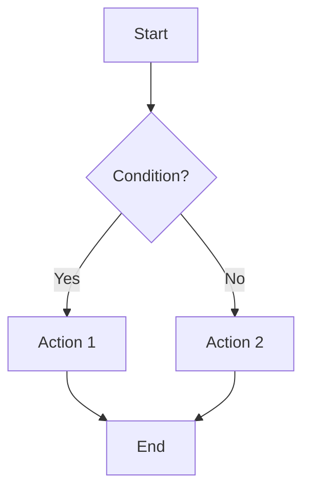

# User Flow: [Flow Name]

**Flow ID:** UF-XX
**Related PRD:** [Link]
**Primary Actor:** [User Role]
**Status:** DRAFT | REVIEW | APPROVED

---

## 1. Overview

### 1.1 Goal
[What does the user want to achieve through this flow?]

### 1.2 Pre-conditions
- [ ] Is the user logged in?
- [ ] Does the user have permission?
- [ ] Does required data exist?

### 1.3 Post-conditions
- [ ] What state change happens after flow?
- [ ] What notifications are sent?

---

## 2. Flow Diagram

---

## 3. Step-by-Step

| Step | Screen | User Action | System Response | Decision/Branch |
|------|--------|-------------|-----------------|-----------------|
| 1 | Home | Click "Enroll" | Open enrollment page | - |
| 2 | Enrollment | Select class | Validate availability | If full → Step 5 |
| 3 | Enrollment | Click "Confirm" | Create enrollment record | - |
| 4 | Enrollment | - | Show success message | - |
| 5 | Enrollment | - | Show error: CLASS_FULL | End |

---

## 4. Happy Path

1. User navigates to [Screen A]
2. User clicks [Button]
3. System validates [Condition]
4. System performs [Action]
5. User sees [Success State]

---

## 5. Alternative Paths

### 5.1 Error: [Error Name]
- **Trigger:** [Condition]
- **User sees:** [Error message]
- **Recovery:** [What can the user do?]

### 5.2 Edge Case: [Edge Case Name]
- **Trigger:** [Condition]
- **System behavior:** [What happens]

---

## 6. Business Rules Involved

| Rule ID | Description | Applied at Step |
|---------|-------------|-----------------|
| BR-XX-01 | | Step X |
| BR-XX-02 | | Step Y |

---

## 7. Screens Involved

| Screen Name | Route | Purpose in Flow |
|-------------|-------|-----------------|
| Screen A | `/path/a` | Entry point |
| Screen B | `/path/b` | Main action |
| Screen C | `/path/c` | Confirmation |

---

## 8. API Calls in Flow

| Step | Method | Endpoint | Purpose |
|------|--------|----------|---------|
| 1 | GET | `/api/resource` | Fetch data |
| 3 | POST | `/api/resource` | Submit action |

---

## 9. Error Handling Summary

| Error Code | User Message | Recovery Action |
|------------|--------------|-----------------|
| CLASS_FULL | "Class is full" | Show other classes |
| NOT_ENROLLED | "You are not enrolled" | Redirect to enrollment |